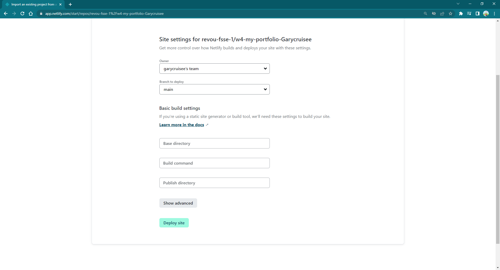
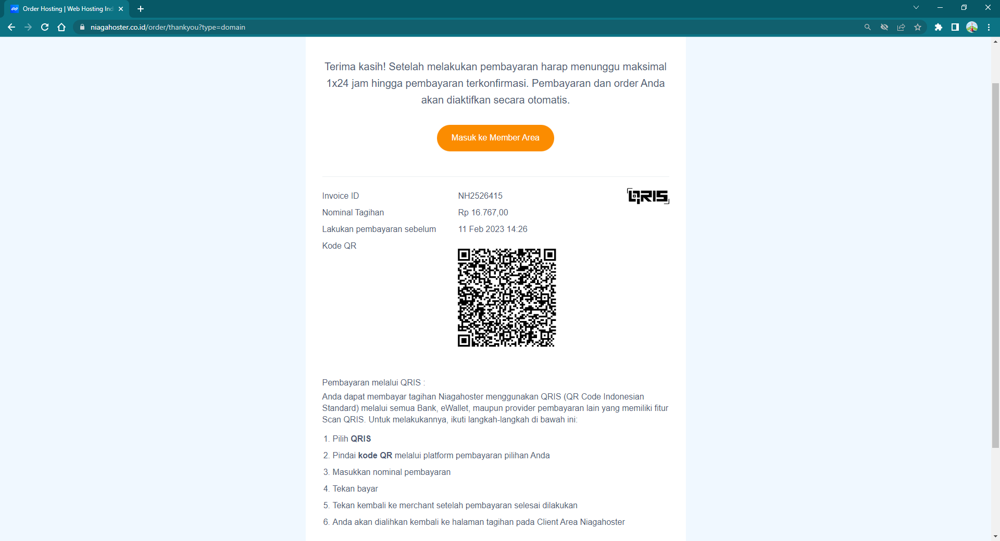

# Week 4 Project - Website Deployment

> This project is to deploy your own web using custom domain.

## Link to Website

[https://cobainweb.site/](https://cobainweb.site/)

---

## Deployment Process

### Netlify

- First, sign in using your Netlify account.

- Press "Add new site" to import a new project.

- Choose Github to connect.

- Choose your repository.

- Deploy Site.

- Your webpage is already depolyed!

### Niagahoster

- First, sign in into your account.

- At the main page, scroll down.

- Choose "Order Sekarang" / Domain.

- Type of your desired domain name.

- Look for existing & available domain name.

- Choose your type of paying method.

- Pay.

- Wait, until your payment is verivied.

- After verivied, open the menu site.

- you can manage your domain name through customer portal.

### Cloudflare

- First, Log in or Sign up to your Clouflare account.

- Press "Add site".

- Type your domain name.

- Choose free plan.

- Input your netlify link under dns management tab.

- Replace Nameserver 1 & 2 from niagahoster and fill them with Cloudflare nameserver.

- Congrats!

- Check your netlify account to see if server already taking place. (it might takes a while.)
